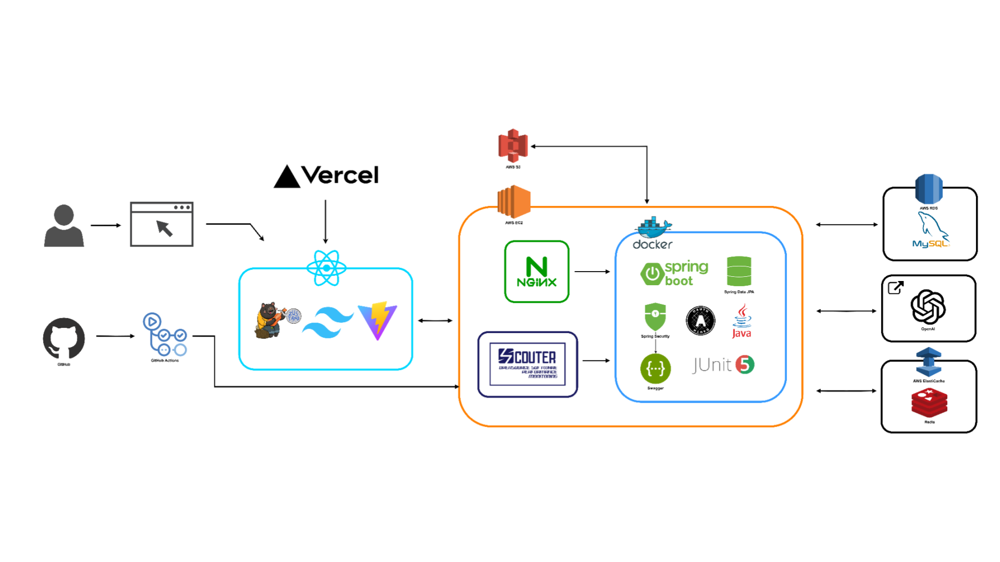

# 🐶 반려견 미용을 위한 최적의 장소, 미용멍당

### LG U+ URECA 최종융합프로젝트 2어조 미용멍당 서비스 FE

- 개발 기간 : 2024.11.12 ~ 2024.12.19
- 전체 팀원 (총 7명)
  - FRONT-END : 노승희, 서윤기, 홍시영
  - BACK-END : 김범수, 서민수, 이도림, 정시은


## 📢 서비스 소개 : 강아지 미용 중계 서비스

반려견의 견종, 스타일, 크기 등에 따라 맞춤형 미용 견적을 요청하고, 미용사와의 실시간 소통을 통해 투명하고 합리적인 미용 서비스를 제공받을 수 있는 **강아지 미용 중계 플랫폼**입니다. 😊

## 👥 TEAM

|                                                                **노승희**                                                                 |                                                              **서윤기**                                                               |                                                             **홍시영**                                                             |
| :---------------------------------------------------------------------------------------------------------------------------------------: | :-----------------------------------------------------------------------------------------------------------------------------------: | :--------------------------------------------------------------------------------------------------------------------------------: |
| [ <br/> @seung-heee](https://github.com/seung-heee) | [ <br/> @Suh-code](https://github.com/Suh-code) | [ <br/> @hongsi0](https://github.com/hongsi0) |
|                                                               **FRONT-END**                                                               |                                                             **FRONT-END**                                                             |                                                           **FRONT-END**                                                            |

|                                                                 **김범수**                                                                 |                                                             **서민수**                                                             |                                                              **이도림**                                                              |                                                             **정시은**                                                             |
| :----------------------------------------------------------------------------------------------------------------------------------------: | :--------------------------------------------------------------------------------------------------------------------------------: | :----------------------------------------------------------------------------------------------------------------------------------: | :--------------------------------------------------------------------------------------------------------------------------------: |
| [ <br/> @KIMBUMSU123](https://github.com/KIMBUMSU123) | [ <br/> @Minsu17](https://github.com/Minsu17) | [ <br/> @LeeDoRim](https://github.com/LeeDoRim) | [ <br/> @Sieun53](https://github.com/Sieun53) |
|                                                                **BACK-END**                                                                |                                                            **BACK-END**                                                            |                                                             **BACK-END**                                                             |                                                            **BACK-END**                                                            |

## 🙋‍♀️ 주요 기능 및 서비스

**로그인/회원가입**

- 소셜로그인(Kakao, Google)
- 가입 후 고객 혹은 미용사 선택
- 미용사/고객 전환 가능
- 로그아웃

**프로필 관리**

- 사용자는 고객 및 미용사 프로필을 등록/수정/삭제
- 고객은 반려견 프로필을 등록/수정/삭제
- 미용사는 매장 등록/수정/삭제

**결제시스템**

- PG 결제 시스템 적용하여 간편 결제 지원

**예약 시스템**

- 미용 예약 정보 조회/취소 가능
- 미용사는 오늘의 예약 미리보기 조회 가능
- 고객이 견적서를 결제해야만 예약 확정

**미용 견적 입찰 시스템**

- 견적서 요청
  1. 고객은 전체 미용사를 대상으로 견적 공고 게시
  2. 고객은 원하는 미용사를 선택하여 견적서 요청
- 고객은 견적서를 보낸 미용사들의 프로필 확인 가능
- 고객은 원하는 미용사의 견적서를 결제하여 예약 확정 가능
- 미용사는 견적 요청이 들어온 항목들에서 원하는 요청에 견적서
  전달 가능
- 미용사는 고객이 올린 견적 공고 조회 가능
- 미용사는 받은 견적서 요청 건수 미리보기 가능

**리뷰 시스템**

- 반려견 미용 후 리뷰 등록/수정/삭제
- 리뷰 좋아요 기능
- 메인페이지에 Best 후기 (좋아요 많이 받은 순) 게시

**채팅 시스템**

- 고객과 미용사의 실시간 채팅

**알림 시스템**

- 견적 요청/견적서 수신/실시간 채팅/예약 완료 등 알림 확인

## 🗾 Architecture



## ⎍ ERD


## 🎨 Figma


## 🧑🏻‍💻 프로젝트 관리 도구

| **도구**   | **도입 이유**                                                                                                                       |
| ---------- | ----------------------------------------------------------------------------------------------------------------------------------- |
| **Slack**  | 팀원 간의 실시간 커뮤니케이션과 파일 공유를 통해 협업 효율성을 높이고, 알림 시스템을 통해 중요한 정보를 빠르게 전달하기 위해 도입.  |
| **WBS**    | 프로젝트의 체계적인 관리와 작업 분류를 통해 일정과 자원의 효율적인 할당을 지원하며, 명확한 업무 분담으로 생산성을 높이기 위해 사용. |
| **Notion** | 작업 관리, 문서화, 데이터베이스 기능을 통합하여 모든 프로젝트 정보를 한곳에서 관리할 수 있는 환경을 제공하기 위해 선택.             |
| **Github** | 버전 관리와 협업 기능을 통해 코드의 변경 내역을 효율적으로 추적하고, 팀원 간의 원활한 코드 공유와 협력을 지원하기 위해 사용.        |

## 🛠 FRONT-END 기술

| **기술**            | **도입 이유**                                                                                                   |
| ------------------- | --------------------------------------------------------------------------------------------------------------- |
| **React**           | 컴포넌트 기반 설계로 코드 재사용성과 유지보수성이 뛰어나며, 효율적인 UI 개발을 지원하기 위해 도입.              |
| **Vite**            | 빠른 개발 환경과 빌드 속도로 생산성을 높이고, React와의 높은 호환성 덕분에 개발 속도를 향상시키기 위해 사용.    |
| **Yarn**            | 빠르고 안정적인 의존성 관리를 통해 개발 환경 설정을 간소화하고 효율적으로 관리하기 위해 선택.                   |
| **Tailwind CSS**    | 유틸리티 기반의 스타일링으로 디자인 개발 속도를 높이고, 반응형 웹을 쉽게 구현하기 위해 사용.                    |
| **Zustand**         | 간결한 API와 전역 상태 관리를 효율적으로 처리할 수 있어 복잡한 상태 관리 비용을 줄이기 위해 도입.               |
| **React Router**    | SPA(단일 페이지 애플리케이션) 환경에서 간편하게 라우팅을 처리하고, 사용자 경험을 개선하기 위해 선택.            |
| **React Hot Toast** | 알림/토스트 메시지를 간단하고 직관적으로 구현하며 사용자에게 중요한 정보를 전달하기 위해 사용.                  |
| **Swiper.js**       | 가볍고 유연한 슬라이더 라이브러리로 배너 및 이미지 슬라이더를 간단히 구현하고 사용자 경험을 강화하기 위해 선택. |
| **Axios**           | API 호출과 데이터 통신을 쉽게 처리하고, HTTP 요청의 커스터마이징 및 에러 처리를 효율적으로 구현하기 위해 도입.  |

## 🛠 BACK-END 기술

| **목차**       | **기술**                       | **도입 이유**                                                                                                  |
|----------------|--------------------------------|---------------------------------------------------------------------------------------------------------------|
| Backend        | **Java 17, Spring Boot 3.3.3** | 안정적이고 효율적인 서버 개발을 위해 최신 Java와 Spring Boot의 성능과 기능을 활용하기 위해 도입.                    |
|                | **Spring Data JPA**            | 데이터베이스와의 상호작용을 간소화하고 생산성을 높이기 위해 도입.                                                     |
|                | **Spring Security, JWT, Oauth** | 인증 및 권한 관리를 강화하고, 보안성을 높이기 위해 사용.                                                               |
| Database       | **MySQL**                      | 안정적이고 널리 사용되는 관계형 데이터베이스로 데이터 저장 및 관리를 위해 선택.                                           |
|                | **Redis**                      | 캐싱 및 세션 관리를 통해 빠른 데이터 처리와 시스템 성능 최적화를 위해 도입.                                               |
| 클라우드        | **AWS**                       | 유연하고 확장 가능한 클라우드 서비스 제공을 위해 사용.                                                                 |
|                | **Amazon S3**                  | 대규모 데이터 저장 및 관리, 정적 파일 호스팅을 위해 도입.                                                                |
|                | **AWS RDS**                   | 관계형 데이터베이스 관리를 자동화하여 안정성과 효율성을 높이기 위해 도입.                                                  |
|                | **AWS ElastiCache**            | Redis 기반의 고성능 관리형 캐시 서비스로 확장성과 운영 효율성을 높이기 위해 사용.                                          |
| 인프라          | **Docker**                    | 컨테이너 기반 환경으로 애플리케이션 배포 및 관리를 효율적으로 수행하기 위해 사용.                                            |
|                | **Nginx**                      | 로드 밸런싱과 정적 파일 제공을 통해 웹 애플리케이션의 안정성과 성능을 향상시키기 위해 사용.                                   |
| CI/CD          | **Github Actions**             | 자동화된 빌드, 테스트, 배포 프로세스를 통해 효율적인 개발 워크플로우를 구현하기 위해 도입.                                     |
| 배포            | **AWS EC2**                   | 확장 가능하고 안정적인 가상 서버 환경을 제공하며, 애플리케이션을 안정적으로 호스팅하기 위해 사용.                              |
| APM            | **Scouter**                    | 실시간 모니터링과 애플리케이션 성능 분석을 통해 안정적이고 효율적인 운영을 위해 도입.                                      |
| API 문서화      | **Swagger**                    | API 문서화를 통해 개발자 간 협업을 원활히 하고, 클라이언트와의 명확한 통신 사양을 정의하기 위해 사용.                         |


## 💁🏻‍♀️ 역할 분담

#### 노승희

- 소셜 로그인(Kakao, Google)
- 회원(고객/미용사) 프로필 관리
- 매장, 반려견 프로필 관리
- 리뷰 관리
- SSE 알림 구현
- Chat gpt OpenAI 연결
- 프론트 배포(Vercel)

#### 서윤기

- PG 결제 시스템
- 실시간 채팅 시스템(Websocket)
- 프론트 배포(Vercel)

#### 홍시영

- 지도 및 매장상세 구현
- 미용 견적 입찰 관리
- 프론트 배포(Vercel)

#### 김범수

- 소셜 로그인
- 회원가입
- 고객, 미용사 마이페이지
- Chat GPT Open AI

#### 서민수

- 고객 프로필 및 주소
- PG 결제 시스템
- 견적 예약 시스템
- SSE 알림 구현
- 백엔드 배포

#### 이도림

- 미용 견적 입찰 시스템
- 미용사 프로필 및 리뷰
- 실시간 채팅 시스템
- 백엔드 배포

#### 정시은

- 미용 견적 입찰 시스템
- 매장 프로필
- 반려견 프로필
- 실시간 채팅 시스템
- 리뷰 좋아요

### 🤙🏻 Git Commit Message Convention

#### 1. 커밋 유형 지정

- 커밋 유형은 영어 대문자로 작성하기
  | 커밋 유형 | 의미 |
  | ------------------ | ------------------------------------------------------------ |
  | `Feat` | 새로운 기능 추가 |
  | `Fix` | 버그 수정 |
  | `Docs` | 문서 수정 |
  | `Style` | 코드 formatting, 세미콜론 누락, 코드 자체의 변경이 없는 경우 |
  | `Refactor` | 코드 리팩토링 |
  | `Test` | 테스트 코드, 리팩토링 테스트 코드 추가 |
  | `Chore` | 패키지 매니저 수정, 그 외 기타 수정 ex) .gitignore |
  | `Design` | CSS 등 사용자 UI 디자인 변경 |
  | `Comment` | 필요한 주석 추가 및 변경 |
  | `Rename` | 파일 또는 폴더 명을 수정하거나 옮기는 작업만인 경우 |
  | `Remove` | 파일을 삭제하는 작업만 수행한 경우 |
  | `!BREAKING CHANGE` | 커다란 API 변경의 경우 |
  | `!HOTFIX` | 급하게 치명적인 버그를 고쳐야 하는 경우 |

#### 2. 제목 첫 글자는 대문자로, 끝에는 `.` 금지

#### 3. 제목은 영문 기준 50자 이내로 할 것

#### 4. 자신의 코드가 직관적으로 바로 파악할 수 있다고 생각하지 말자

#### 5. 여러가지 항목이 있다면 글머리 기호를 통해 가독성 높이기

#### 6. 커밋 메세지 구조

```
type: subject

body (없으면 생략 가능)

footer (유형: #이슈번호)
```

#### 8. footer 유형

| **키워드**      | **설명**                                                                             |
| --------------- | ------------------------------------------------------------------------------------ |
| **Fixes**       | 이슈 수정 중 (아직 해결되지 않은 경우).                                              |
| **Ref**         | 참고할 이슈가 있을 때 사용.                                                          |
| **Related to**  | 해당 커밋에 관련된 이슈 번호 (아직 해결되지 않은 경우).                              |
| **Resolves**    | 이슈를 해결했을 때 사용 (이슈 닫힘).                                                 |
| **종료 키워드** | 커밋으로 이슈를 닫을 때 사용(close / closes / closed, resolve / resolves / resolved) |

<!--

## 🖥️ Project Setup

### **Prerequisites**

- **Node.js**
- **npm** (or **yarn**)

### **Installation**

1. **Clone the Repository**

   ```bash
   git clone https://github.com/URECA-FINAL-TEAM2/frontend.git
   cd frontend
   ```

2. Install Dependencies
   ```bash
   yarn install (or yarn i)
   ```
3. Set Up Environment Variables

   Please contact one of our members to obtain the variables

4. Start the Server
   ```bash
   yarn dev
   ```
   The server should now be running at http://localhost:5173
 -->
